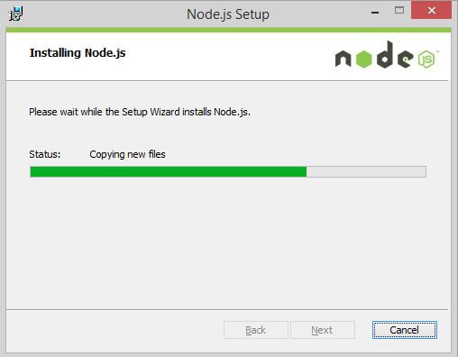

## Sumber [https://www.dumetschool.com/blog/cara-install-node-js-dan-npm-pada-windows](https://www.dumetschool.com/blog/cara-install-node-js-dan-npm-pada-windows)

## Using Windows

1. Download Node.JS Installer pada website resminya di [https://nodejs.org/download/](https://nodejs.org/download/)
2. Jalankan file msi yang sudah didownload.
3. Ikuti petunjuk dan User Agreement. Dan tunggu sampai installasi selesai.
4. Sekarang kalian restart computer kalian agar node js dapat terinstall dengan sempurna.





5. Untuk melihat versi node js yang terinstall.

```
node -v
```

6. Untuk melihat versi npm yang terinstall.

```
npm -v
```