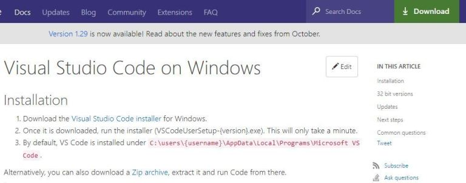
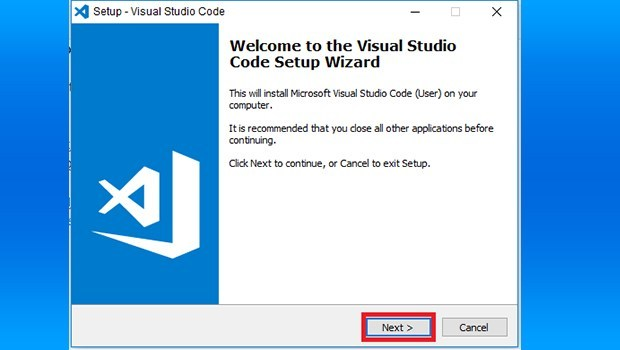
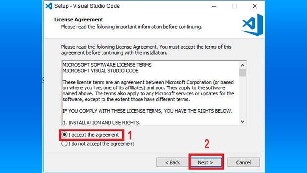
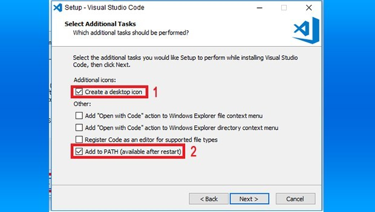
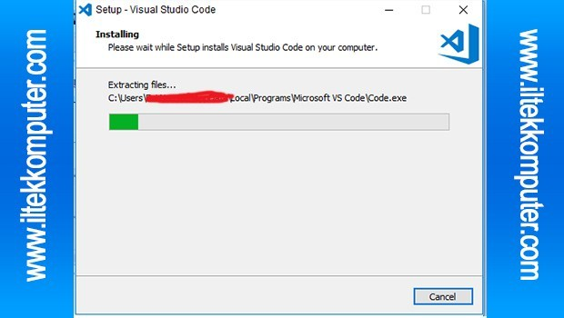
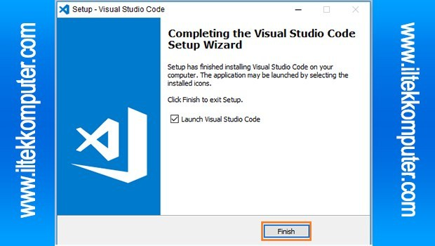

## Sumber [https://www.dumetschool.com/blog/cara-install-node-js-dan-npm-pada-windows](https://www.dumetschool.com/blog/cara-install-node-js-dan-npm-pada-windows)

## Using Windows

1.  link Download nya silahkan dibuka [https://code.visualstudio.com/docs/setup/windows](https://code.visualstudio.com/docs/setup/windows)

2. Jika sudah di buka silahkan klik download di pojok kanan atas atau juga bisa dengan mengklik “Download the Visual Studio Code installer for Windows.” seperti gambar di bawah ini.

3. Jika sudah klik/buka Aplikasi VSCode yang sudah di download, Kemudian ikuti kotak merah pada gambar klik Next.

4. Kemudian pilih “I accept the agreement” untuk menyetujui kebijakan dari VSCode lalu klik Next.

5. Kemudian klik Next lagi itu hanya penempatan direktori file programnya, lalu Next untuk membuat folder nya, Kemudian Ceklis “Create Desktop Icon” jika ingin membuat shortcut VSCode nya kemudian ceklis “Add to PATH (available after restart) jika sudah klik Next. 

6. Kemudian Klik Install tunggu sampai “Setup has finished installing Visual Studio Code on your komputer” . kemudian klik Finish seperti gambar dibawah ini.

Selesai!
